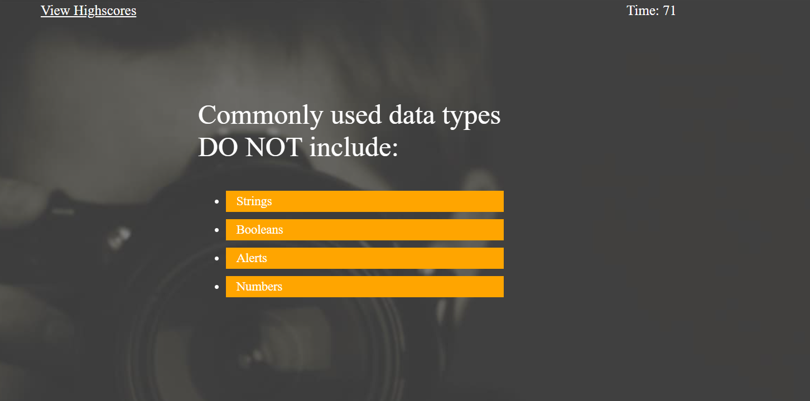
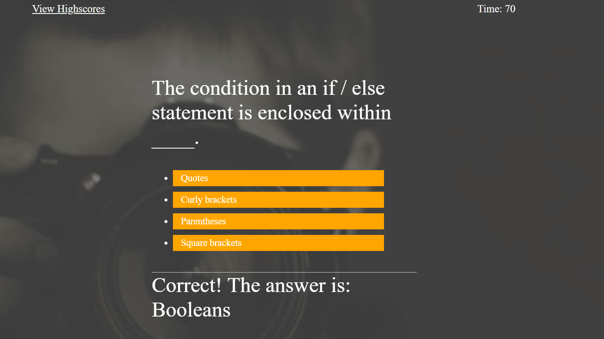
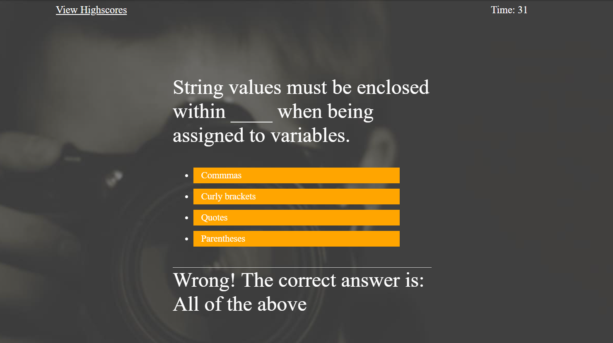
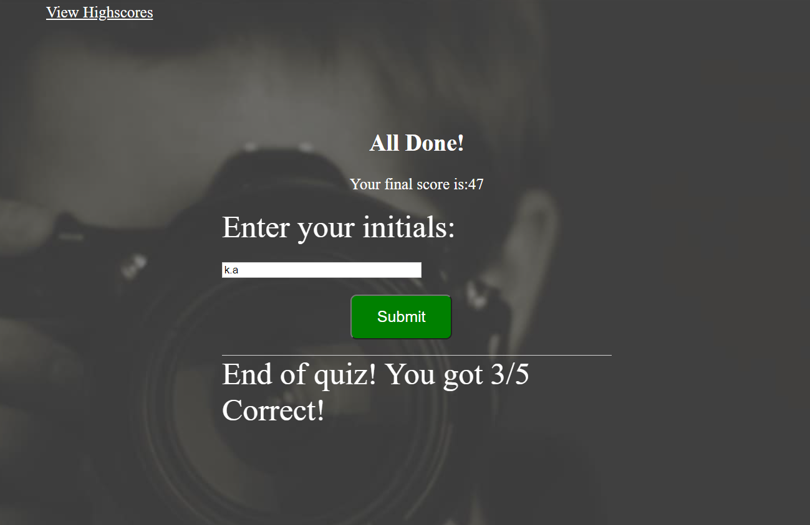

# Title # JavaScript-CodeQuiz

# Summary
* HTML and CSS and Javascript documents create a quiz with multiple choice questions with Javascript trivia
* This project emphasizes the use of using Javascript to make dynamic changes to an HMTL document
* This project utilizes the use of appending HTML pages

# user Story

* Given is a code quiz
* When clicked the start button the a timer starts and user is presented with  a question.
* When user answer a question than the user is presented with another question
* When the user answer a question incorrectly then the time is subtracted from the clock by -10sec.
* When all questions are answered or the timer reaches 0 then the game is over.
* When the game is over then the user can save his/her initials and score.

# Screenshots

Please see below the screenshots when the Code is deployed:

